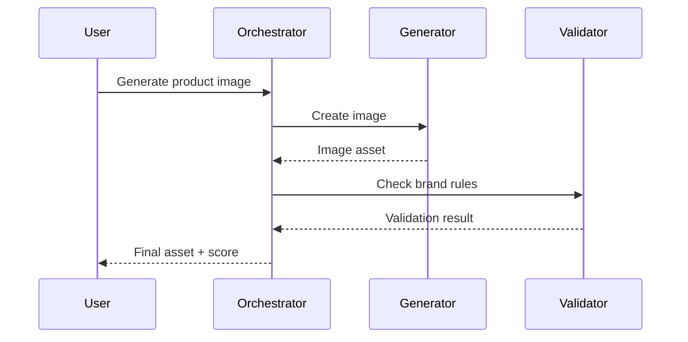
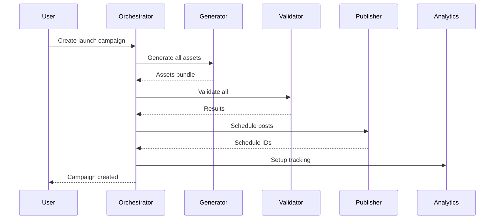

# AGENTS.md - Multi-Agent System Architecture

This document describes the multi-agent architecture patterns for FlashFusion, enabling autonomous AI workflows for content creation, campaign management, and platform orchestration.

---

## Overview

FlashFusion uses a multi-agent architecture to handle complex content creation workflows. Agents are specialized AI systems that work together to:

1. **Generate** - Create text, images, video, and music
2. **Validate** - Check brand compliance and quality
3. **Orchestrate** - Manage multi-step workflows
4. **Publish** - Distribute content across platforms
5. **Analyze** - Track performance and optimize

---

## Agent Architecture

```
┌─────────────────────────────────────────────────────────────────┐
│                     ORCHESTRATOR AGENT                          │
│              (Workflow Coordination & Planning)                 │
└─────────────────────────────────────────────────────────────────┘
                              │
        ┌─────────────────────┼─────────────────────┐
        ▼                     ▼                     ▼
┌───────────────┐     ┌───────────────┐     ┌───────────────┐
│   GENERATOR   │     │   VALIDATOR   │     │   PUBLISHER   │
│     AGENT     │     │     AGENT     │     │     AGENT     │
│               │     │               │     │               │
│ • Text Gen    │     │ • Brand Rules │     │ • Instagram   │
│ • Image Gen   │     │ • Quality     │     │ • Twitter     │
│ • Video Gen   │     │ • Compliance  │     │ • LinkedIn    │
│ • Music Gen   │     │ • Safety      │     │ • TikTok      │
└───────────────┘     └───────────────┘     └───────────────┘
        │                     │                     │
        └─────────────────────┼─────────────────────┘
                              ▼
                    ┌───────────────┐
                    │   ANALYTICS   │
                    │     AGENT     │
                    │               │
                    │ • Tracking    │
                    │ • Reporting   │
                    │ • Optimization│
                    └───────────────┘
```

---

## Agent Definitions

### 1. Orchestrator Agent

**Purpose**: Coordinates multi-step workflows and manages agent interactions.

**Capabilities**:
- Parse user intent from natural language
- Plan execution steps
- Delegate tasks to specialized agents
- Handle failures and retries
- Aggregate results

**Implementation**:
```typescript
// Edge Function: orchestrator
interface OrchestratorRequest {
  intent: string;
  context: {
    orgId: string;
    brandKitId?: string;
    campaignId?: string;
  };
  constraints?: {
    maxSteps?: number;
    timeout?: number;
  };
}

interface OrchestratorPlan {
  steps: AgentTask[];
  estimatedDuration: number;
  requiredAgents: string[];
}

interface AgentTask {
  id: string;
  agent: 'generator' | 'validator' | 'publisher' | 'analytics';
  action: string;
  input: Record<string, unknown>;
  dependsOn?: string[];
}
```

**Example Flow**:
```
User: "Create a product launch campaign for social media"

Orchestrator Plan:
1. [Generator] Generate hero image
2. [Generator] Generate product description
3. [Generator] Generate social captions (Twitter, Instagram, LinkedIn)
4. [Validator] Check brand compliance for all assets
5. [Publisher] Schedule posts to platforms
6. [Analytics] Set up tracking for campaign
```

---

### 2. Generator Agent

**Purpose**: Creates content assets using AI models.

**Capabilities**:
- Text generation (copy, captions, descriptions)
- Image generation (visuals, graphics, photos)
- Video generation (clips, animations)
- Music generation (background, jingles)

**Edge Functions**:
- `generate-content` - General content generation
- `generate-youtube-content` - YouTube-optimized
- `generate-tiktok-content` - TikTok-optimized

**Input Schema**:
```typescript
interface GeneratorRequest {
  type: 'text' | 'image' | 'video' | 'music';
  prompt: string;
  style?: string;
  brandContext?: {
    colors: string[];
    voice: string;
    guidelines: string[];
  };
  platform?: 'instagram' | 'twitter' | 'linkedin' | 'tiktok' | 'youtube';
  dimensions?: {
    width: number;
    height: number;
  };
}

interface GeneratorResponse {
  assetId: string;
  content: string | Blob;
  metadata: {
    model: string;
    promptHash: string;
    tokenCount?: number;
    generationTime: number;
  };
}
```

**Platform-Specific Optimizations**:

| Platform | Image Size | Video Length | Text Limit |
|----------|-----------|--------------|------------|
| Instagram | 1080x1080 | 60s Reels | 2200 chars |
| Twitter | 1200x675 | 140s | 280 chars |
| LinkedIn | 1200x627 | 10min | 3000 chars |
| TikTok | 1080x1920 | 3min | 2200 chars |
| YouTube | 1280x720 | Unlimited | 5000 chars |

---

### 3. Validator Agent

**Purpose**: Ensures content meets brand guidelines and quality standards.

**Capabilities**:
- Brand rule enforcement
- Content quality scoring
- Safety and compliance checks
- Accessibility validation

**Validation Rules**:
```typescript
interface BrandRules {
  colors: {
    primary: string[];
    secondary: string[];
    forbidden: string[];
  };
  typography: {
    fonts: string[];
    sizes: { min: number; max: number };
  };
  voice: {
    tone: 'formal' | 'casual' | 'playful' | 'professional';
    vocabulary: {
      preferred: string[];
      forbidden: string[];
    };
  };
  imagery: {
    styles: string[];
    forbidden: string[];
  };
}

interface ValidationResult {
  passed: boolean;
  score: number; // 0-100
  violations: Violation[];
  suggestions: Suggestion[];
}

interface Violation {
  rule: string;
  severity: 'error' | 'warning' | 'info';
  location: string;
  message: string;
}
```

**Safety Checks**:
- Prompt injection detection
- XSS prevention
- PII detection
- NSFW content filtering
- Copyright risk assessment

---

### 4. Publisher Agent

**Purpose**: Distributes content to social media platforms.

**Capabilities**:
- Multi-platform publishing
- Scheduled posting
- Retry with exponential backoff
- Status tracking

**Supported Platforms**:
| Platform | API | Auth | Features |
|----------|-----|------|----------|
| Instagram | Graph API v18 | OAuth 2.0 | Feed, Stories, Reels |
| Twitter/X | API v2 | OAuth 2.0 | Tweets, Threads |
| LinkedIn | API v2 | OAuth 2.0 | Posts, Articles |
| TikTok | Marketing API | OAuth 2.0 | Videos, Spark Ads |
| YouTube | Data API v3 | OAuth 2.0 | Videos, Shorts |
| Facebook | Graph API v18 | OAuth 2.0 | Posts, Stories |

**Publishing Flow**:
```typescript
interface PublishRequest {
  assetId: string;
  platform: Platform;
  scheduledFor?: Date;
  caption: string;
  hashtags?: string[];
  mentions?: string[];
  visibility: 'public' | 'private' | 'followers';
}

interface PublishResult {
  success: boolean;
  platformPostId?: string;
  url?: string;
  error?: {
    code: string;
    message: string;
    retryable: boolean;
  };
}
```

**Retry Strategy**:
```typescript
const RETRY_CONFIG = {
  maxAttempts: 3,
  initialDelay: 1000, // 1 second
  maxDelay: 30000,    // 30 seconds
  backoffFactor: 2,
  retryableErrors: [
    'RATE_LIMIT',
    'NETWORK_ERROR',
    'TIMEOUT',
    'SERVICE_UNAVAILABLE'
  ]
};
```

---

### 5. Analytics Agent

**Purpose**: Tracks performance and provides optimization insights.

**Capabilities**:
- Event tracking
- Performance metrics collection
- Trend analysis
- Optimization recommendations

**Event Schema**:
```typescript
interface AnalyticsEvent {
  eventType: string;
  eventCategory: 'generation' | 'campaign' | 'schedule' | 'publish';
  orgId: string;
  userId: string;
  metadata: {
    assetId?: string;
    campaignId?: string;
    platform?: string;
    durationMs?: number;
    success?: boolean;
  };
  timestamp: Date;
}
```

**Metrics Collected**:
| Metric | Description | Aggregation |
|--------|-------------|-------------|
| Generation Time | Time to generate content | Avg, P95 |
| Success Rate | % successful generations | Daily |
| Platform Reach | Views per platform | Sum |
| Engagement Rate | Interactions / Views | Avg |
| Brand Compliance | % passing validation | Avg |

---

## Agent Communication

### Message Format

Agents communicate via structured messages:

```typescript
interface AgentMessage {
  id: string;
  from: AgentId;
  to: AgentId;
  type: 'request' | 'response' | 'event' | 'error';
  payload: unknown;
  correlationId?: string;
  timestamp: Date;
  ttl?: number;
}
```

### Event Bus

Agents publish/subscribe to events:

```typescript
// Event types
type AgentEvent =
  | { type: 'asset.generated'; assetId: string }
  | { type: 'asset.validated'; assetId: string; passed: boolean }
  | { type: 'post.scheduled'; scheduleId: string }
  | { type: 'post.published'; postId: string; platformPostId: string }
  | { type: 'post.failed'; postId: string; error: string };

// Subscribe pattern
eventBus.subscribe('asset.*', async (event) => {
  // Handle asset events
});
```

---

## Workflow Examples

### 1. Single Asset Generation



### 2. Campaign Creation



### 3. A/B Test Workflow

```typescript
const abTestWorkflow = {
  steps: [
    {
      id: 'generate-variants',
      agent: 'generator',
      action: 'generateVariants',
      input: {
        prompt: 'Product headline',
        variants: 3
      }
    },
    {
      id: 'validate-all',
      agent: 'validator',
      action: 'validateBatch',
      input: {
        assetIds: '${generate-variants.assetIds}'
      },
      dependsOn: ['generate-variants']
    },
    {
      id: 'create-experiment',
      agent: 'analytics',
      action: 'createExperiment',
      input: {
        name: 'Headline Test',
        variants: '${generate-variants.assetIds}',
        splitRatio: [33, 33, 34],
        duration: '7d'
      },
      dependsOn: ['validate-all']
    },
    {
      id: 'schedule-variants',
      agent: 'publisher',
      action: 'scheduleWithExperiment',
      input: {
        experimentId: '${create-experiment.experimentId}',
        platforms: ['twitter', 'instagram']
      },
      dependsOn: ['create-experiment']
    }
  ]
};
```

---

## Error Handling

### Error Types

```typescript
enum AgentErrorCode {
  // Orchestrator errors
  INVALID_INTENT = 'ORCH_001',
  WORKFLOW_TIMEOUT = 'ORCH_002',
  AGENT_UNAVAILABLE = 'ORCH_003',

  // Generator errors
  GENERATION_FAILED = 'GEN_001',
  QUOTA_EXCEEDED = 'GEN_002',
  INVALID_PROMPT = 'GEN_003',
  SAFETY_VIOLATION = 'GEN_004',

  // Validator errors
  VALIDATION_FAILED = 'VAL_001',
  BRAND_RULES_MISSING = 'VAL_002',

  // Publisher errors
  PLATFORM_ERROR = 'PUB_001',
  AUTH_EXPIRED = 'PUB_002',
  RATE_LIMITED = 'PUB_003',

  // Analytics errors
  TRACKING_FAILED = 'ANA_001',
  QUOTA_CHECK_FAILED = 'ANA_002',
}
```

### Circuit Breaker Pattern

```typescript
// supabase/functions/_shared/circuit-breaker.ts
interface CircuitBreakerConfig {
  failureThreshold: number;  // Open after N failures
  successThreshold: number;  // Close after N successes
  timeout: number;           // Time in open state
}

class CircuitBreaker {
  private state: 'closed' | 'open' | 'half-open' = 'closed';
  private failures = 0;
  private successes = 0;
  private lastFailure?: Date;

  async execute<T>(fn: () => Promise<T>): Promise<T> {
    if (this.state === 'open') {
      if (this.shouldAttemptReset()) {
        this.state = 'half-open';
      } else {
        throw new Error('Circuit breaker is open');
      }
    }

    try {
      const result = await fn();
      this.onSuccess();
      return result;
    } catch (error) {
      this.onFailure();
      throw error;
    }
  }

  private onSuccess() {
    this.failures = 0;
    if (this.state === 'half-open') {
      this.successes++;
      if (this.successes >= this.config.successThreshold) {
        this.state = 'closed';
        this.successes = 0;
      }
    }
  }

  private onFailure() {
    this.failures++;
    this.lastFailure = new Date();
    if (this.failures >= this.config.failureThreshold) {
      this.state = 'open';
    }
  }
}
```

---

## Implementing New Agents

### Agent Template

```typescript
// supabase/functions/agent-[name]/index.ts
import { serve } from "https://deno.land/std@0.168.0/http/server.ts";
import { createClient } from "https://esm.sh/@supabase/supabase-js@2";
import { corsHeaders } from "../_shared/cors.ts";
import { withRetry } from "../_shared/retry.ts";
import { CircuitBreaker } from "../_shared/circuit-breaker.ts";

interface AgentRequest {
  action: string;
  input: Record<string, unknown>;
  context: {
    orgId: string;
    userId: string;
    correlationId?: string;
  };
}

interface AgentResponse {
  success: boolean;
  result?: unknown;
  error?: {
    code: string;
    message: string;
  };
  metadata: {
    duration: number;
    agent: string;
    action: string;
  };
}

const circuitBreaker = new CircuitBreaker({
  failureThreshold: 5,
  successThreshold: 2,
  timeout: 30000,
});

serve(async (req) => {
  const start = Date.now();

  if (req.method === 'OPTIONS') {
    return new Response(null, { headers: corsHeaders });
  }

  try {
    const request: AgentRequest = await req.json();

    const result = await circuitBreaker.execute(() =>
      handleAction(request)
    );

    const response: AgentResponse = {
      success: true,
      result,
      metadata: {
        duration: Date.now() - start,
        agent: 'agent-name',
        action: request.action,
      },
    };

    return new Response(JSON.stringify(response), {
      headers: { ...corsHeaders, 'Content-Type': 'application/json' },
    });

  } catch (error) {
    const response: AgentResponse = {
      success: false,
      error: {
        code: error.code || 'UNKNOWN',
        message: error.message,
      },
      metadata: {
        duration: Date.now() - start,
        agent: 'agent-name',
        action: 'unknown',
      },
    };

    return new Response(JSON.stringify(response), {
      status: 500,
      headers: { ...corsHeaders, 'Content-Type': 'application/json' },
    });
  }
});

async function handleAction(request: AgentRequest): Promise<unknown> {
  switch (request.action) {
    case 'action1':
      return handleAction1(request.input);
    case 'action2':
      return handleAction2(request.input);
    default:
      throw new Error(`Unknown action: ${request.action}`);
  }
}
```

---

## Monitoring Agents

### Health Checks

Each agent exposes a health endpoint:

```typescript
// GET /health
{
  "status": "healthy" | "degraded" | "unhealthy",
  "uptime": 123456,
  "version": "1.0.0",
  "circuitBreaker": "closed" | "open" | "half-open",
  "lastError": null | {
    "time": "2025-01-01T00:00:00Z",
    "message": "Error description"
  }
}
```

### Metrics

Agents emit metrics to observability stack:

```typescript
// OpenTelemetry metrics
const metrics = {
  'agent.requests.total': Counter,
  'agent.requests.duration': Histogram,
  'agent.errors.total': Counter,
  'agent.circuit_breaker.state': Gauge,
};
```

### Alerting Rules

```yaml
# Prometheus alerting rules
groups:
  - name: agent-alerts
    rules:
      - alert: AgentHighErrorRate
        expr: rate(agent_errors_total[5m]) > 0.1
        for: 5m
        labels:
          severity: warning

      - alert: AgentCircuitOpen
        expr: agent_circuit_breaker_state == 2
        for: 1m
        labels:
          severity: critical
```

---

## Future Enhancements

### Planned Agents

1. **Translation Agent**
   - Multi-language content translation
   - Cultural adaptation
   - Quality review workflow

2. **Personalization Agent**
   - Audience segmentation
   - Dynamic content variation
   - A/B test optimization

3. **Moderation Agent**
   - Content safety review
   - Legal compliance checking
   - Brand risk assessment

4. **Collaboration Agent**
   - Real-time editing sync
   - Comment management
   - Approval workflows

### Agent Marketplace

Future support for third-party agents:

```typescript
interface AgentManifest {
  id: string;
  name: string;
  version: string;
  author: string;
  capabilities: string[];
  inputs: SchemaDefinition;
  outputs: SchemaDefinition;
  pricing: {
    model: 'free' | 'per-request' | 'subscription';
    cost?: number;
  };
}
```

---

## Resources

- [Orchestrator Design](./docs/orchestrator.md)
- [API Reference](./docs/openapi.yaml)
- [Security Guide](./docs/security.md)
- [Performance Guide](./docs/performance.md)

---

*Last updated: 2025-12-30*
