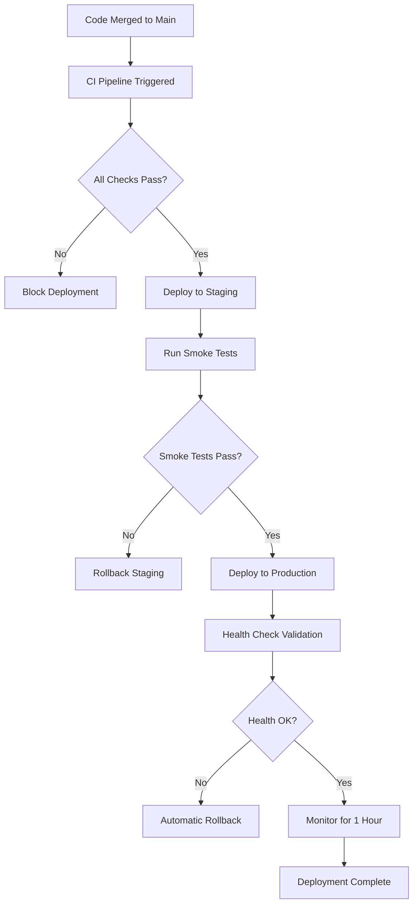

# Operations Runbook

> **Last Updated**: 2026-01-21  
> **Owner**: Platform Engineering  
> **On-Call Escalation**: ops@flashfusion.co

## Table of Contents

1. [Deployment Procedures](#deployment-procedures)
2. [Monitoring & Alerting](#monitoring--alerting)
3. [Incident Response Playbooks](#incident-response-playbooks)
4. [Rollback Procedures](#rollback-procedures)
5. [Health Checks](#health-checks)
6. [Secrets Management](#secrets-management)
7. [Performance Baselines](#performance-baselines)

---

## Deployment Procedures

### Pre-Deployment Checklist

```
□ All CI checks pass (tests, lint, typecheck)
□ Security linter passes with zero errors/warnings
□ Performance budgets met (see budgets.json)
□ Database migrations tested in staging
□ Feature flags configured appropriately
□ Rollback plan documented
□ On-call engineer notified
```

### Standard Deployment Flow



### Deployment Commands

#### Frontend Deployment
```bash
# Build production bundle
npm run build

# Preview deployment (Lovable)
# Automatic via Lovable platform

# Production deployment
# Automatic via GitHub Actions on main branch merge
```

#### Edge Functions Deployment
```bash
# Deploy all edge functions
supabase functions deploy

# Deploy specific function
supabase functions deploy generate-content

# Verify deployment
curl -X POST https://trxmsoyjjoopnvzohmvi.supabase.co/functions/v1/health
```

#### Database Migrations
```bash
# Generate migration
supabase migration new <migration_name>

# Apply migration (staging)
supabase db push --linked

# Apply migration (production)
# Via Lovable Cloud migration tool with user approval
```

### Blue-Green Deployment Strategy

1. **Prepare Green Environment**
   - Deploy new version to green slot
   - Run health checks on green

2. **Switch Traffic**
   - Update load balancer to point to green
   - Keep blue running for 15 minutes

3. **Validate**
   - Monitor error rates
   - Check latency metrics
   - Verify critical user flows

4. **Cleanup**
   - Decommission blue environment
   - Update deployment records

---

## Monitoring & Alerting

### Critical Metrics Dashboard

| Metric | Warning Threshold | Critical Threshold | Action |
|--------|-------------------|-------------------|--------|
| Error Rate | > 1% | > 5% | Investigate immediately |
| P95 Latency | > 500ms | > 2000ms | Scale or optimize |
| Circuit Breaker Opens | Any | 3+ in 5min | Check external deps |
| Auth Failures | > 10/min | > 50/min | Check auth service |
| Database Connections | > 80% pool | > 95% pool | Scale connections |
| Edge Function Errors | > 5/min | > 20/min | Check function logs |

### Alert Channels

```yaml
Critical (P1):
  - PagerDuty: ops-critical
  - Slack: #incidents-critical
  - SMS: On-call rotation

High (P2):
  - Slack: #incidents-high
  - Email: ops-team@flashfusion.co

Medium (P3):
  - Slack: #monitoring
  - Daily digest email

Low (P4):
  - Weekly report only
```

### Monitoring Endpoints

| Endpoint | Purpose | Expected Response |
|----------|---------|-------------------|
| `/functions/v1/health` | Edge function health | `{ "status": "healthy" }` |
| `/rest/v1/` | Database connectivity | 200 OK |
| `/auth/v1/health` | Auth service health | 200 OK |
| `/storage/v1/` | Storage availability | 200 OK |

### Observability Stack

```
┌─────────────────────────────────────────────────────────┐
│                    Observability                         │
├─────────────────┬─────────────────┬─────────────────────┤
│     Logging     │     Metrics     │      Tracing        │
├─────────────────┼─────────────────┼─────────────────────┤
│ Structured JSON │ MetricsCollector│ Tracer (OpenTel)    │
│ RequestId ctx   │ Counter/Gauge   │ Span correlation    │
│ Supabase logs   │ PostHog events  │ Request tracing     │
└─────────────────┴─────────────────┴─────────────────────┘
                          │
                          ▼
              ┌───────────────────────┐
              │   Sentry (Errors)     │
              │   PostHog (Analytics) │
              └───────────────────────┘
```

---

## Incident Response Playbooks

### Severity Definitions

| Severity | Definition | Response Time | Examples |
|----------|------------|---------------|----------|
| **P1 - Critical** | Complete service outage | < 15 min | Auth down, DB unavailable |
| **P2 - Major** | Significant feature broken | < 1 hour | Content generation failing |
| **P3 - Minor** | Limited impact | < 4 hours | Single integration down |
| **P4 - Warning** | Potential issue | Next business day | Elevated error rates |

### Incident Response Procedure

```
┌──────────────────────────────────────────────────────────┐
│                  INCIDENT DETECTED                        │
└────────────────────────┬─────────────────────────────────┘
                         │
                         ▼
┌──────────────────────────────────────────────────────────┐
│  1. ACKNOWLEDGE                                          │
│     - Claim incident in PagerDuty                        │
│     - Post in #incidents with severity                   │
│     - Start incident timeline                            │
└────────────────────────┬─────────────────────────────────┘
                         │
                         ▼
┌──────────────────────────────────────────────────────────┐
│  2. ASSESS                                               │
│     - Determine blast radius                             │
│     - Identify affected systems                          │
│     - Check recent deployments                           │
└────────────────────────┬─────────────────────────────────┘
                         │
                         ▼
┌──────────────────────────────────────────────────────────┐
│  3. MITIGATE                                             │
│     - Apply immediate fix OR rollback                    │
│     - Enable feature flags if needed                     │
│     - Scale resources if required                        │
└────────────────────────┬─────────────────────────────────┘
                         │
                         ▼
┌──────────────────────────────────────────────────────────┐
│  4. RESOLVE                                              │
│     - Confirm service restored                           │
│     - Update status page                                 │
│     - Notify stakeholders                                │
└────────────────────────┬─────────────────────────────────┘
                         │
                         ▼
┌──────────────────────────────────────────────────────────┐
│  5. POST-MORTEM (within 48 hours)                        │
│     - Document timeline                                  │
│     - Identify root cause                                │
│     - Create action items                                │
└──────────────────────────────────────────────────────────┘
```

### Playbook: Database Connection Exhaustion

**Symptoms:**
- Queries timing out
- "Connection pool exhausted" errors
- Elevated latency across all endpoints

**Diagnosis:**
```sql
-- Check active connections
SELECT count(*) FROM pg_stat_activity;

-- Check connection by state
SELECT state, count(*) 
FROM pg_stat_activity 
GROUP BY state;

-- Find long-running queries
SELECT pid, now() - pg_stat_activity.query_start AS duration, query
FROM pg_stat_activity
WHERE state != 'idle'
ORDER BY duration DESC
LIMIT 10;
```

**Mitigation:**
1. Kill idle connections older than 10 minutes
2. Increase connection pool size temporarily
3. Identify and fix connection leaks in code
4. Consider pgBouncer for connection pooling

### Playbook: Edge Function Failures

**Symptoms:**
- High error rate on specific function
- Timeouts in function logs
- Circuit breaker opened

**Diagnosis:**
```bash
# Check function logs
supabase functions logs generate-content --tail

# Check circuit breaker state
curl https://trxmsoyjjoopnvzohmvi.supabase.co/functions/v1/health
```

**Mitigation:**
1. Check external API dependencies (OpenAI, etc.)
2. Verify secrets are configured correctly
3. Check rate limits on external services
4. Redeploy function if code issue suspected

### Playbook: Authentication Failures

**Symptoms:**
- Users unable to login
- JWT validation errors
- Session expiration issues

**Diagnosis:**
```sql
-- Check recent auth events
SELECT * FROM auth.audit_log_entries
ORDER BY created_at DESC
LIMIT 50;

-- Check for locked accounts
SELECT * FROM auth.users
WHERE banned_until > NOW();
```

**Mitigation:**
1. Verify Supabase Auth service status
2. Check JWT secret configuration
3. Clear problematic sessions if needed
4. Review IP rate limiting settings

### Playbook: Content Generation Failures

**Symptoms:**
- Asset generation returning errors
- Timeouts on generate-content endpoint
- Usage limits exceeded messages

**Diagnosis:**
```sql
-- Check usage for org
SELECT * FROM usage_credits WHERE org_id = '<org_id>';

-- Check recent generation attempts
SELECT * FROM audit_log 
WHERE action = 'content_generated'
ORDER BY created_at DESC
LIMIT 20;
```

**Mitigation:**
1. Verify API keys (GOOGLE_AI_API_KEY, OPENAI_API_KEY)
2. Check external AI service status
3. Review usage limits and reset if needed
4. Enable fallback model routing

### Playbook: OAuth Integration Failures

**Symptoms:**
- Social logins failing
- Integration connections breaking
- Token refresh errors

**Diagnosis:**
```sql
-- Check integration status
SELECT provider, status, expires_at, updated_at
FROM integrations
WHERE org_id = '<org_id>';

-- Check for expired tokens
SELECT * FROM integrations
WHERE expires_at < NOW()
AND status = 'connected';
```

**Mitigation:**
1. Verify OAuth credentials in secrets
2. Check redirect URI configuration
3. Manually trigger token refresh
4. Re-authorize affected integrations

---

## Rollback Procedures

### Frontend Rollback

```bash
# Via Lovable
# 1. Open project history
# 2. Select previous working version
# 3. Click "Restore"

# Via GitHub
git revert HEAD
git push origin main
```

### Edge Function Rollback

```bash
# Deploy previous version
supabase functions deploy <function_name> --legacy-bundle

# Or revert code and redeploy
git checkout HEAD~1 -- supabase/functions/<function_name>
supabase functions deploy <function_name>
```

### Database Rollback

```sql
-- CRITICAL: Always backup before rollback
-- Revert migration (if reversible)
-- Execute rollback SQL from migration file

-- Example: Revert column addition
ALTER TABLE assets DROP COLUMN IF EXISTS new_column;
```

### Rollback Decision Matrix

| Condition | Action |
|-----------|--------|
| Error rate > 10% post-deploy | Immediate rollback |
| P95 latency > 5s | Rollback within 15 min |
| Critical feature broken | Immediate rollback |
| Minor regression | Fix forward if < 2 hours |

---

## Health Checks

### Application Health Endpoints

```typescript
// Edge function health check response
{
  "status": "healthy",
  "version": "1.0.0",
  "timestamp": "2026-01-21T00:00:00Z",
  "checks": {
    "database": "ok",
    "storage": "ok",
    "external_apis": "ok"
  },
  "circuit_breakers": {
    "openai": "closed",
    "google_ai": "closed"
  }
}
```

### Health Check Frequency

| Check | Interval | Timeout | Retries |
|-------|----------|---------|---------|
| Edge Functions | 30s | 5s | 2 |
| Database | 60s | 10s | 3 |
| Storage | 60s | 5s | 2 |
| External APIs | 5m | 30s | 1 |

### Synthetic Monitoring

```yaml
Golden Path Tests (every 5 minutes):
  1. User Authentication Flow
     - Sign up
     - Login
     - Token refresh

  2. Content Generation Flow
     - Create asset
     - Validate brand
     - Save to library

  3. Campaign Creation Flow
     - Draft campaign
     - Attach assets
     - Schedule posts
```

---

## Secrets Management

### Current Secrets Inventory

| Secret | Purpose | Rotation Frequency |
|--------|---------|-------------------|
| `SUPABASE_SERVICE_ROLE_KEY` | Admin database access | 90 days |
| `KEYRING_TOKEN` | Token encryption | 180 days |
| `GOOGLE_AI_API_KEY` | Gemini API access | On demand |
| `OPENAI_API_KEY` | GPT API access | On demand |
| `STRIPE_SECRET_KEY` | Payment processing | 90 days |
| `RESEND_API_KEY` | Email delivery | 90 days |
| `GOOGLE_OAUTH_CLIENT_SECRET` | OAuth authentication | On demand |

### Secret Rotation Procedure

1. **Generate New Secret**
   - Create new key in provider console
   - Do not revoke old key yet

2. **Update in Supabase**
   - Add new secret via Lovable Cloud
   - Verify edge functions can access

3. **Validate**
   - Test affected functionality
   - Monitor for errors

4. **Revoke Old Secret**
   - Wait 24 hours after validation
   - Revoke old key in provider console

### Emergency Secret Rotation

```bash
# If secret is compromised:
1. Immediately revoke compromised secret
2. Generate new secret
3. Update via Lovable Cloud Secrets UI
4. Redeploy affected edge functions
5. Audit logs for unauthorized access
6. File security incident report
```

---

## Performance Baselines

### Frontend Budgets (budgets.json)

```json
{
  "timings": {
    "TTFB": 150,
    "FCP": 1800,
    "LCP": 2500,
    "INP": 200,
    "CLS": 0.08
  },
  "sizes": {
    "js_per_route_gzip_kb": 180,
    "css_total_gzip_kb": 35
  }
}
```

### API Performance Targets

| Endpoint | P50 | P95 | P99 |
|----------|-----|-----|-----|
| `/auth/login` | 100ms | 300ms | 500ms |
| `/generate-content` | 2s | 5s | 10s |
| `/campaigns-draft` | 500ms | 1s | 2s |
| `/schedule` | 100ms | 200ms | 500ms |

### Database Query Targets

| Query Type | Target | Alert Threshold |
|------------|--------|-----------------|
| Simple SELECT | < 10ms | > 100ms |
| Complex JOIN | < 100ms | > 500ms |
| Full-text search | < 200ms | > 1s |
| Aggregations | < 500ms | > 2s |

---

## Emergency Contacts

| Role | Contact | Escalation Time |
|------|---------|-----------------|
| On-Call Engineer | PagerDuty rotation | Immediate |
| Platform Lead | Slack @platform-lead | 15 min |
| Security Team | security@flashfusion.co | 15 min (security incidents) |
| VP Engineering | Direct phone | 30 min (P1 only) |

---

## Appendix: Common Commands

### Useful Supabase CLI Commands

```bash
# Check function status
supabase functions list

# View function logs
supabase functions logs <name> --tail

# Check database status
supabase db remote status

# Generate types
supabase gen types typescript --linked > src/integrations/supabase/types.ts
```

### Useful SQL Queries

```sql
-- Check table sizes
SELECT
  tablename,
  pg_size_pretty(pg_total_relation_size(schemaname||'.'||tablename)) AS size
FROM pg_tables
WHERE schemaname = 'public'
ORDER BY pg_total_relation_size(schemaname||'.'||tablename) DESC;

-- Check slow queries
SELECT query, calls, mean_time, total_time
FROM pg_stat_statements
ORDER BY mean_time DESC
LIMIT 10;

-- Check RLS policy usage
SELECT * FROM pg_policies WHERE schemaname = 'public';
```

---

*This runbook is a living document. Update after every significant incident or operational change.*
