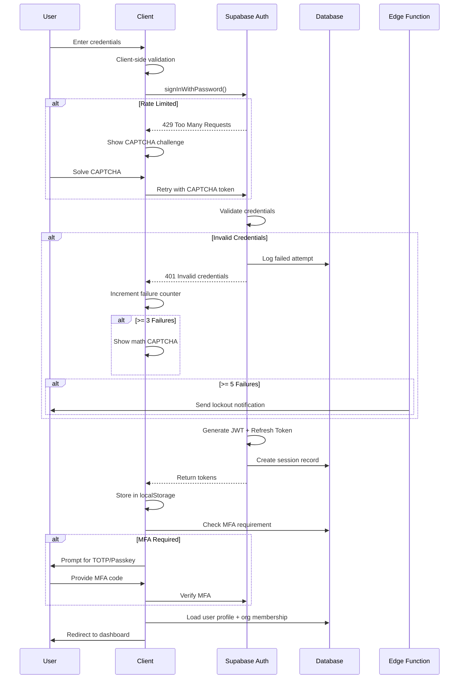
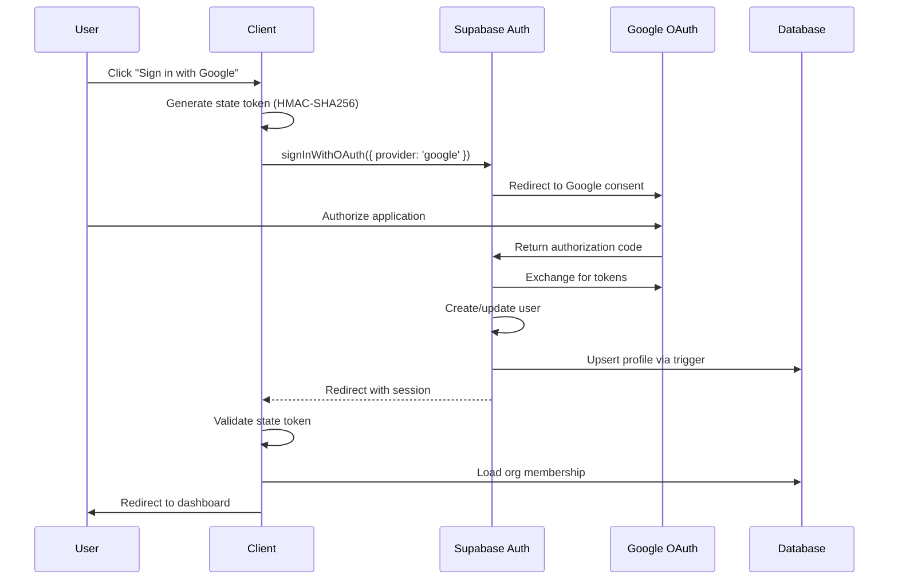
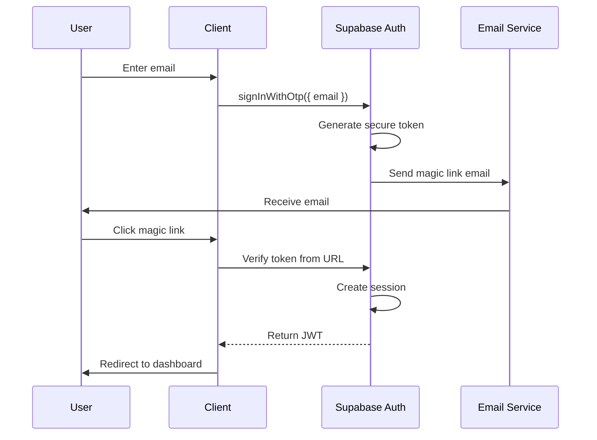
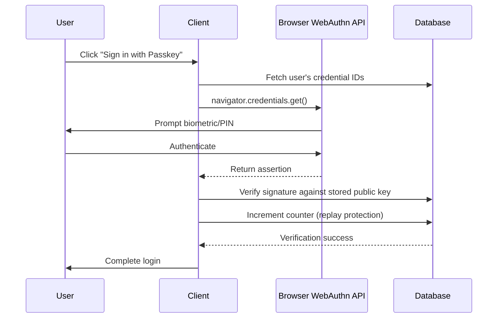

# Security Model Reference

> **Version**: 1.0.0  
> **Last Updated**: 2026-01-21  
> **Classification**: Internal Engineering  
> **Owner**: Security Team

---

## Table of Contents

1. [Security Architecture Overview](#security-architecture-overview)
2. [Authentication Flows](#authentication-flows)
3. [Authorization Model](#authorization-model)
4. [Row-Level Security (RLS) Policies](#row-level-security-policies)
5. [Threat Model](#threat-model)
6. [Token Management](#token-management)
7. [Input Validation & Sanitization](#input-validation--sanitization)
8. [Rate Limiting & Abuse Prevention](#rate-limiting--abuse-prevention)
9. [Cryptographic Standards](#cryptographic-standards)
10. [Security Headers & CSP](#security-headers--csp)
11. [Audit & Compliance](#audit--compliance)

---

## Security Architecture Overview

### Defense-in-Depth Layers

```
┌─────────────────────────────────────────────────────────────────┐
│                      LAYER 1: NETWORK                           │
│  CDN → WAF → Rate Limiting → Security Headers (HSTS, CSP)       │
├─────────────────────────────────────────────────────────────────┤
│                    LAYER 2: APPLICATION                         │
│  Input Validation → DOMPurify → Zod Schemas → CSRF Protection   │
├─────────────────────────────────────────────────────────────────┤
│                    LAYER 3: AUTHENTICATION                      │
│  JWT Tokens → Session Management → MFA (TOTP/Passkeys)          │
├─────────────────────────────────────────────────────────────────┤
│                    LAYER 4: AUTHORIZATION                       │
│  RBAC → RLS Policies → Organization Scoping → Role Checks       │
├─────────────────────────────────────────────────────────────────┤
│                      LAYER 5: DATA                              │
│  Encryption at Rest → Token Encryption → Audit Logging          │
└─────────────────────────────────────────────────────────────────┘
```

### Core Security Principles

| Principle | Implementation |
|-----------|----------------|
| Zero Trust | All requests validated; no implicit trust |
| Least Privilege | Roles grant minimal necessary permissions |
| Defense in Depth | Multiple security layers |
| Secure by Default | RLS enabled on all tables |
| Fail Secure | Errors deny access; no information leakage |

---

## Authentication Flows

### 1. Email/Password Authentication



### 2. OAuth Authentication (Google)



### 3. Magic Link Authentication



### 4. Passkey/WebAuthn Authentication



### Session Management

| Aspect | Configuration |
|--------|---------------|
| JWT Expiry | 1 hour |
| Refresh Token Expiry | 7 days (30 days with "Remember Me") |
| Session Storage | localStorage (encrypted) |
| Auto-Refresh | Yes, via Supabase client |
| Concurrent Sessions | Allowed (tracked in `user_sessions`) |

### Logout Flow

```typescript
// Complete logout procedure
async function signOut() {
  // 1. Revoke server session
  await supabase.auth.signOut();
  
  // 2. Clear local storage
  localStorage.removeItem('supabase.auth.token');
  
  // 3. Clear application state
  queryClient.clear();
  
  // 4. Redirect to login
  window.location.href = '/auth';
}
```

---

## Authorization Model

### Role Hierarchy

```
OWNER (org creator)
  │
  ├── Full org management
  ├── Billing & subscription
  ├── Delete organization
  └── All admin permissions
        │
ADMIN (delegated authority)
  │
  ├── Member management
  ├── Integration management
  ├── Brand kit management
  └── All editor permissions
        │
EDITOR (content creator)
  │
  ├── Create/edit content
  ├── Manage campaigns
  ├── Schedule posts
  └── All member permissions
        │
MEMBER (collaborator)
  │
  ├── View all org content
  ├── Create personal assets
  └── All viewer permissions
        │
VIEWER (read-only)
  │
  └── View org content only
```

### Role Permissions Matrix

| Resource | Owner | Admin | Editor | Member | Viewer |
|----------|-------|-------|--------|--------|--------|
| Org Settings | ✅ RW | ✅ R | ❌ | ❌ | ❌ |
| Members | ✅ CRUD | ✅ CRUD | ❌ | ❌ | ❌ |
| Brand Kits | ✅ CRUD | ✅ CRUD | ✅ R | ✅ R | ✅ R |
| Assets | ✅ CRUD | ✅ CRUD | ✅ CRUD | ✅ CR | ✅ R |
| Campaigns | ✅ CRUD | ✅ CRUD | ✅ CRUD | ✅ R | ✅ R |
| Schedules | ✅ CRUD | ✅ CRUD | ✅ CRUD | ✅ R | ✅ R |
| Integrations | ✅ CRUD | ✅ CRUD | ❌ | ❌ | ❌ |
| Audit Logs | ✅ R | ✅ R | ❌ | ❌ | ❌ |
| Usage/Billing | ✅ RW | ✅ R | ❌ | ❌ | ❌ |

### Server-Side Role Validation

```typescript
// CORRECT: Server-side role check via RLS
const { data, error } = await supabase
  .from('members')
  .select('role')
  .eq('user_id', user.id)
  .eq('org_id', orgId)
  .single();

// The RLS policy validates this automatically
// Client-side checks are for UX only, NOT security
```

### Role Check Functions

```sql
-- Check org membership
CREATE OR REPLACE FUNCTION is_member_of_org(_org_id UUID, _user_id UUID)
RETURNS BOOLEAN AS $$
  SELECT EXISTS (
    SELECT 1 FROM members
    WHERE org_id = _org_id AND user_id = _user_id
  );
$$ LANGUAGE sql STABLE SECURITY DEFINER;

-- Check admin privileges
CREATE OR REPLACE FUNCTION is_member_admin(_org_id UUID, _user_id UUID)
RETURNS BOOLEAN AS $$
  SELECT EXISTS (
    SELECT 1 FROM members
    WHERE org_id = _org_id 
      AND user_id = _user_id
      AND role IN ('owner', 'admin')
  );
$$ LANGUAGE sql STABLE SECURITY DEFINER;
```

---

## Row-Level Security Policies

### Policy Design Principles

1. **Deny by Default**: RLS enabled, no access without explicit policy
2. **Organization Scoping**: All data isolated by `org_id`
3. **Least Privilege**: Minimal permissions per role
4. **Security Definer Functions**: Bypass RLS for privilege checks

### Core RLS Patterns

#### Pattern 1: Organization-Scoped Access

```sql
-- Members can read their org's data
CREATE POLICY "Org members can read"
ON assets FOR SELECT
TO authenticated
USING (is_member_of_org(org_id, auth.uid()));

-- Members can insert to their org
CREATE POLICY "Org members can insert"
ON assets FOR INSERT
TO authenticated
WITH CHECK (is_member_of_org(org_id, auth.uid()));
```

#### Pattern 2: Admin-Only Operations

```sql
-- Only admins can manage integrations
CREATE POLICY "Admins can manage integrations"
ON integrations FOR ALL
TO authenticated
USING (is_member_admin(org_id, auth.uid()))
WITH CHECK (is_member_admin(org_id, auth.uid()));
```

#### Pattern 3: User-Owned Resources

```sql
-- Users can only modify their own profiles
CREATE POLICY "Users can update own profile"
ON profiles FOR UPDATE
TO authenticated
USING (id = auth.uid())
WITH CHECK (id = auth.uid());
```

#### Pattern 4: Public Read with Restricted Write

```sql
-- Public templates readable by all
CREATE POLICY "Public templates readable"
ON templates FOR SELECT
TO authenticated
USING (is_public = true OR org_id IN (
  SELECT org_id FROM members WHERE user_id = auth.uid()
));
```

### RLS Policy Inventory

| Table | SELECT | INSERT | UPDATE | DELETE |
|-------|--------|--------|--------|--------|
| orgs | Member of org | N/A (via RPC) | Owner only | Owner only |
| members | Member of org | Admin only | Admin only | Admin only |
| profiles | Self or org member | Self only | Self only | N/A |
| assets | Member of org | Member of org | Member of org | Member of org |
| campaigns | Member of org | Editor+ | Editor+ | Admin only |
| schedules | Member of org | Editor+ | Editor+ | Admin only |
| brand_kits | Member of org | Admin only | Admin only | Admin only |
| integrations | Admin only | Admin only | Admin only | Admin only |
| audit_log | Admin only | System only | N/A | N/A |
| usage_credits | Member of org | System only | System only | N/A |

### Tables Without Direct Client Access

These tables are accessed only via security definer functions:

- `ip_rate_limits` - Rate limiting (system managed)
- `user_totp` - TOTP secrets (security critical)
- `backup_codes` - Recovery codes (security critical)
- `security_activity_log` - Audit trail (append only)

---

## Threat Model

### Assets Under Protection

| Asset | Classification | Impact if Compromised |
|-------|---------------|----------------------|
| User credentials | Critical | Account takeover |
| OAuth tokens | Critical | Platform access, data theft |
| Organization data | High | Business intelligence leak |
| User PII | High | Privacy violation, legal liability |
| API keys | Critical | Service abuse, financial loss |
| Generated content | Medium | IP theft, competitive harm |

### Threat Actors

| Actor | Motivation | Capability | Likelihood |
|-------|------------|------------|------------|
| Opportunistic Attacker | Financial gain | Low-Medium | High |
| Malicious Insider | Revenge, profit | Medium-High | Medium |
| Competitor | Business intelligence | Medium | Low |
| State Actor | Espionage | Very High | Very Low |
| Automated Bot | Credential stuffing | Low | Very High |

### Attack Vectors & Mitigations

#### 1. Cross-Organization Data Access

```
THREAT: Attacker manipulates org_id to access other orgs
IMPACT: Critical - full data breach
MITIGATION:
  ├── RLS policies enforce org_id = user's org
  ├── Server-side validation via is_member_of_org()
  └── No client-side org_id trust
STATUS: Mitigated ✅
```

#### 2. Privilege Escalation

```
THREAT: User modifies role to gain admin access
IMPACT: Critical - unauthorized admin actions
MITIGATION:
  ├── Roles stored in members table, not profiles
  ├── RLS restricts role updates to admins
  ├── No client-side role storage
  └── Security definer functions for checks
STATUS: Mitigated ✅
```

#### 3. Session Hijacking

```
THREAT: Attacker steals JWT from localStorage
IMPACT: High - account takeover
MITIGATION:
  ├── Short JWT expiry (1 hour)
  ├── Refresh token rotation
  ├── Session tracking in user_sessions
  ├── Login notifications for new devices
  └── Remote session termination
STATUS: Mitigated ✅
```

#### 4. Credential Stuffing

```
THREAT: Automated login attempts with leaked credentials
IMPACT: Medium - account compromise
MITIGATION:
  ├── IP-based rate limiting (check_ip_rate_limit)
  ├── Progressive lockout (5/15/60 min)
  ├── Math CAPTCHA after 3 failures
  ├── reCAPTCHA v3 integration
  └── Lockout email notifications
STATUS: Mitigated ✅
```

#### 5. OAuth Token Theft

```
THREAT: Attacker accesses stored OAuth tokens
IMPACT: Critical - third-party platform access
MITIGATION:
  ├── Tokens encrypted with PGP (pgcrypto)
  ├── Encryption key in Vault secrets
  ├── Admin-only access via RPC
  ├── Token rotation on refresh
  └── Audit logging of access
STATUS: Mitigated ✅
```

#### 6. XSS/Injection Attacks

```
THREAT: Malicious scripts in user content
IMPACT: High - session theft, defacement
MITIGATION:
  ├── DOMPurify sanitization (client + server)
  ├── Zod schema validation
  ├── CSP headers blocking inline scripts
  ├── React's automatic escaping
  └── CSS injection protection
STATUS: Mitigated ✅
```

#### 7. CSRF Attacks

```
THREAT: Forged requests from malicious sites
IMPACT: Medium - unauthorized actions
MITIGATION:
  ├── SameSite=Lax cookies (Supabase default)
  ├── Origin validation in edge functions
  ├── OAuth state tokens (HMAC-SHA256)
  └── API-only endpoints (no form submissions)
STATUS: Mitigated ✅
```

### STRIDE Analysis

| Threat | Category | Risk | Status |
|--------|----------|------|--------|
| User impersonation | Spoofing | High | Mitigated |
| Audit log tampering | Tampering | Medium | Mitigated |
| Unauthorized data access | Repudiation | Low | Mitigated |
| PII exposure | Information Disclosure | High | Mitigated |
| Rate limit bypass | Denial of Service | Medium | Mitigated |
| Role manipulation | Elevation of Privilege | Critical | Mitigated |

---

## Token Management

### Token Types

| Token Type | Storage | Expiry | Rotation |
|------------|---------|--------|----------|
| JWT Access | localStorage | 1 hour | On expiry |
| Refresh Token | localStorage | 7-30 days | On use |
| OAuth Access | DB (encrypted) | Provider-specific | CRON job |
| OAuth Refresh | DB (encrypted) | Provider-specific | On access refresh |
| TOTP Secret | DB (encrypted) | Never | Manual reset |
| Invitation Token | DB | 7 days | Single use |

### Token Encryption

```sql
-- Write encrypted token
SELECT write_encrypted_integration(
  p_org_id := 'org-uuid',
  p_provider := 'instagram',
  p_access_token := 'actual-token',
  p_refresh_token := 'actual-refresh',
  p_encryption_key := current_setting('app.keyring_token')
);

-- Decrypt token (admin only)
SELECT decrypt_integration_token(
  p_integration_id := 'integration-uuid',
  p_token_type := 'access_token',
  p_encryption_key := current_setting('app.keyring_token')
);
```

### Token Refresh CRON

```typescript
// Scheduled every 6 hours
Deno.cron("refresh-oauth-tokens", "0 */6 * * *", async () => {
  const expiringTokens = await getExpiringTokens(hoursAhead: 12);
  
  for (const integration of expiringTokens) {
    try {
      const newTokens = await refreshProviderToken(integration);
      await updateEncryptedTokens(integration.id, newTokens);
      await logAuditEvent('token_refresh_success', integration);
    } catch (error) {
      await logAuditEvent('token_refresh_failed', integration, error);
      await notifyAdmins(integration.org_id, error);
    }
  }
});
```

---

## Input Validation & Sanitization

### Validation Layers

```
Layer 1: Client-Side (UX)
  └── React Hook Form + Zod schemas
  └── Immediate user feedback

Layer 2: Edge Function (Security)
  └── Zod schema validation
  └── DOMPurify HTML sanitization
  └── Content pattern blocking

Layer 3: Database (Integrity)
  └── CHECK constraints
  └── NOT NULL constraints
  └── Foreign key validation
```

### Zod Schema Example

```typescript
const AssetCreateSchema = z.object({
  name: z.string()
    .min(1, 'Name required')
    .max(255)
    .regex(/^[^<>]*$/, 'Invalid characters'),
  type: z.enum(['image', 'video', 'audio', 'text']),
  org_id: z.string().uuid(),
  content_data: z.object({
    text: z.string().max(10000).optional(),
    url: z.string().url().optional(),
  }).optional(),
});
```

### DOMPurify Configuration

```typescript
const sanitizeConfig = {
  ALLOWED_TAGS: ['p', 'br', 'strong', 'em', 'ul', 'ol', 'li', 'a'],
  ALLOWED_ATTR: ['href', 'target', 'rel'],
  ALLOW_DATA_ATTR: false,
  FORBID_TAGS: ['script', 'style', 'iframe', 'form'],
  FORBID_ATTR: ['onerror', 'onclick', 'onload'],
};

const sanitized = DOMPurify.sanitize(userInput, sanitizeConfig);
```

### Blocked Patterns

```typescript
const BLOCKED_PATTERNS = [
  /<script\b[^<]*(?:(?!<\/script>)<[^<]*)*<\/script>/gi,
  /javascript:/gi,
  /on\w+\s*=/gi,
  /data:/gi,
  /vbscript:/gi,
];
```

---

## Rate Limiting & Abuse Prevention

### Rate Limit Tiers

| Action | Limit | Window | Block Duration |
|--------|-------|--------|----------------|
| Login attempts | 5 | 15 min | 5 min → 15 min → 1 hour |
| Password reset | 3 | 1 hour | 1 hour |
| Content generation | 10 | 1 min | 1 min |
| API requests | 100 | 1 min | 1 min |
| File uploads | 20 | 1 hour | 1 hour |

### Progressive Lockout

```sql
-- Check and update rate limit
SELECT check_ip_rate_limit(
  p_ip_address := '192.168.1.1',
  p_action := 'login',
  p_max_attempts := 5,
  p_window_minutes := 15,
  p_block_minutes := 5
);

-- Returns: { allowed: boolean, attempts: number, blocked_until: timestamp }
```

### Bot Detection

1. **Math CAPTCHA**: Displayed after 3 failed logins
2. **reCAPTCHA v3**: Background scoring on forms
3. **Behavioral Analysis**: Timing, mouse movement patterns
4. **IP Reputation**: Known bot IP blocking

---

## Cryptographic Standards

### Algorithms in Use

| Purpose | Algorithm | Key Size |
|---------|-----------|----------|
| Password Hashing | bcrypt | Cost factor 10 |
| JWT Signing | HS256 | 256-bit |
| Token Encryption | PGP Symmetric | AES-256 |
| State Tokens | HMAC-SHA256 | 256-bit |
| TOTP Secrets | SHA-1 (RFC 6238) | 160-bit |

### Key Management

| Key | Storage | Rotation |
|-----|---------|----------|
| JWT Secret | Supabase managed | Automatic |
| Encryption Key | Vault secrets | 90 days |
| OAuth Client Secret | Edge function secrets | On compromise |
| reCAPTCHA Secret | Edge function secrets | Annual |

---

## Security Headers & CSP

### HTTP Security Headers

```html
<meta http-equiv="Content-Security-Policy" content="
  default-src 'self';
  script-src 'self' 'unsafe-inline' 'unsafe-eval' https://www.google.com https://www.gstatic.com;
  style-src 'self' 'unsafe-inline' https://fonts.googleapis.com;
  img-src 'self' data: https: blob:;
  font-src 'self' https://fonts.gstatic.com;
  connect-src 'self' https://*.supabase.co wss://*.supabase.co https://www.google.com;
  frame-src https://www.google.com;
  report-uri /api/csp-report;
">
```

### Additional Headers

```
Strict-Transport-Security: max-age=31536000; includeSubDomains
X-Content-Type-Options: nosniff
X-Frame-Options: DENY
X-XSS-Protection: 1; mode=block
Referrer-Policy: strict-origin-when-cross-origin
Permissions-Policy: camera=(), microphone=(), geolocation=()
```

---

## Audit & Compliance

### Audit Events Logged

| Event | Data Captured | Retention |
|-------|---------------|-----------|
| Login success | IP, device, timestamp | 90 days |
| Login failure | IP, attempted email | 90 days |
| Password change | Timestamp, IP | 1 year |
| MFA enable/disable | Timestamp, method | 1 year |
| Role change | Old/new role, changed by | 1 year |
| Data export | Requested by, scope | 1 year |
| Data deletion | Deleted by, scope | Permanent |

### Compliance Checklist

| Requirement | Status | Notes |
|-------------|--------|-------|
| GDPR Data Export | ✅ | `/gdpr-export` edge function |
| GDPR Data Deletion | ✅ | `/gdpr-delete` edge function |
| SOC 2 Audit Logging | ✅ | `audit_log` table |
| PCI DSS (if payments) | ⚠️ | Stripe handles card data |
| WCAG 2.2 AA | ✅ | Accessibility tested |

### Security Review Schedule

| Activity | Frequency | Owner |
|----------|-----------|-------|
| Dependency audit | Weekly (automated) | CI/CD |
| RLS policy review | Monthly | Security team |
| Penetration testing | Annually | Third party |
| Access review | Quarterly | Admin |
| Secret rotation | 90 days | DevOps |

---

## Appendix: Security Testing

### Manual Security Tests

```bash
# Test cross-org access (should fail)
curl -X GET "$SUPABASE_URL/rest/v1/assets?org_id=other-org-id" \
  -H "Authorization: Bearer $JWT" \
  -H "apikey: $ANON_KEY"

# Test privilege escalation (should fail)
curl -X PATCH "$SUPABASE_URL/rest/v1/members?id=my-id" \
  -H "Authorization: Bearer $JWT" \
  -H "Content-Type: application/json" \
  -d '{"role": "owner"}'

# Test unauthenticated access (should fail)
curl -X GET "$SUPABASE_URL/rest/v1/assets" \
  -H "apikey: $ANON_KEY"
```

### Automated Security Scans

```yaml
# CI/CD security gates
security:
  - npm audit --audit-level=high
  - trivy image scan
  - semgrep --config=auto
  - playwright test tests/security/
```

---

## Document History

| Version | Date | Author | Changes |
|---------|------|--------|---------|
| 1.0.0 | 2026-01-21 | Security Team | Initial comprehensive model |
