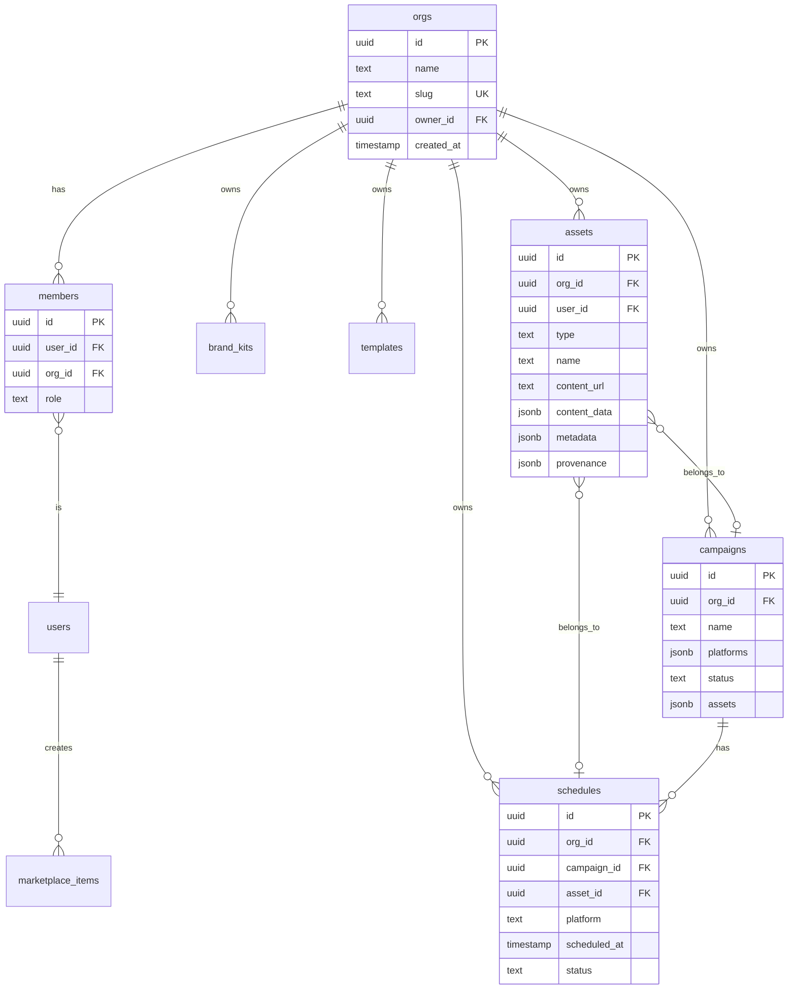
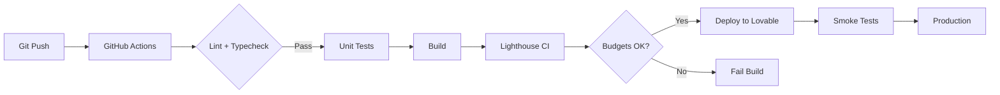

# FlashFusion Architecture

**Version**: 1.0.0  
**Last Updated**: 2025-10-01

---

## System Overview

FlashFusion Creative Mega App is a multi-tenant, AI-powered content creation platform built on modern web technologies. It enables organizations to generate, manage, and schedule creative content across multiple platforms.

### Tech Stack

**Frontend**
- **Framework**: React 18 + TypeScript
- **Build Tool**: Vite 5
- **Styling**: Tailwind CSS v4, shadcn/ui components
- **State Management**: TanStack Query (React Query)
- **Routing**: React Router v6
- **Animations**: Framer Motion

**Backend**
- **Database**: PostgreSQL (via Supabase/Lovable Cloud)
- **Auth**: Supabase Auth (JWT-based)
- **API**: Supabase Edge Functions (Deno runtime)
- **Storage**: Supabase Storage (S3-compatible)
- **AI**: Lovable AI Gateway (GPT-5, Gemini 2.5)

**Infrastructure**
- **Hosting**: Lovable Platform (auto-scaling)
- **CI/CD**: GitHub Actions
- **Monitoring**: Sentry + PostHog (planned)
- **Payments**: Stripe (planned)

---

## Architecture Diagram

```
┌────────────────────────────────────────────────────────────┐
│                         Frontend                            │
│  ┌──────────────────────────────────────────────────────┐  │
│  │  React App (Vite)                                     │  │
│  │  - Landing, Auth, Dashboard, Content Studio          │  │
│  │  - Campaign Wizard, Scheduler, Marketplace           │  │
│  └──────────────────────────────────────────────────────┘  │
│                            │                                │
│                            │ HTTPS + JWT                    │
│                            ▼                                │
├────────────────────────────────────────────────────────────┤
│                      API Layer (Edge)                       │
│  ┌──────────────────────────────────────────────────────┐  │
│  │  Supabase Edge Functions                             │  │
│  │  - /generate-content (text, image, video, music)     │  │
│  │  - /campaigns/draft (future)                         │  │
│  │  - /schedule (future)                                │  │
│  └──────────────────────────────────────────────────────┘  │
│                            │                                │
│                            ▼                                │
├────────────────────────────────────────────────────────────┤
│                      Data Layer                             │
│  ┌─────────────────┐  ┌─────────────────┐                 │
│  │   PostgreSQL    │  │  Supabase Auth  │                 │
│  │   - orgs        │  │  - JWT tokens   │                 │
│  │   - members     │  │  - sessions     │                 │
│  │   - assets      │  └─────────────────┘                 │
│  │   - campaigns   │                                       │
│  │   - schedules   │  ┌─────────────────┐                 │
│  │   - templates   │  │ Supabase Storage│                 │
│  │   - marketplace │  │  - user-uploads │                 │
│  └─────────────────┘  └─────────────────┘                 │
├────────────────────────────────────────────────────────────┤
│                   External Services                         │
│  ┌─────────────────┐  ┌─────────────────┐                 │
│  │  Lovable AI     │  │  Stripe (future)│                 │
│  │  - GPT-5        │  │  - subscriptions│                 │
│  │  - Gemini 2.5   │  │  - marketplace  │                 │
│  └─────────────────┘  └─────────────────┘                 │
└────────────────────────────────────────────────────────────┘
```

---

## Data Model

### Core Entities



### Key Relationships

- **1 org → many members** (multi-tenant isolation)
- **1 org → many assets** (content ownership)
- **1 campaign → many assets** (reusable content)
- **1 asset → many schedules** (cross-posting)

---

## Security Architecture

### Multi-Tenancy Model

**Org-scoped RLS (Row-Level Security)** enforces data isolation:

```sql
-- Example: Only org members can view assets
CREATE POLICY "org_members_view_assets" ON assets
FOR SELECT USING (
  org_id IN (
    SELECT org_id FROM members WHERE user_id = auth.uid()
  )
);
```

All tables with `org_id` have similar policies for INSERT, UPDATE, DELETE.

### Authentication Flow

1. User signs up/in via Supabase Auth
2. JWT token stored in localStorage (auto-refresh enabled)
3. Every API request includes `Authorization: Bearer <JWT>`
4. Edge Functions validate JWT via Supabase client
5. RLS policies use `auth.uid()` to enforce access control

### Provenance Tracking

All AI-generated assets log:
```json
{
  "model": "gpt-5",
  "provider": "lovable-ai",
  "prompt_hash": "sha256:abc123...",
  "timestamp": "2025-10-01T12:00:00Z",
  "user_agent": "Mozilla/5.0..."
}
```

Enables audit trails for compliance (GDPR, CCPA).

---

## Performance Strategy

### Frontend Optimization

- **Code Splitting**: Lazy-load routes with `React.lazy()`
- **Image Optimization**: Responsive images, lazy loading, WebP format
- **Bundle Size**: Target <180KB JS, <35KB CSS per route
- **Caching**: Service Worker for offline support (future)

### Backend Optimization

- **Edge Functions**: Deploy globally for <100ms latency
- **Database Indexing**: All foreign keys + frequently queried columns
- **Connection Pooling**: PgBouncer (Supabase managed)
- **CDN**: Supabase Storage behind Cloudflare CDN

### Monitoring

- **Lighthouse CI**: Automated performance budgets in CI/CD
- **Core Web Vitals**: TTFB, LCP, INP, CLS tracked
- **Real User Monitoring**: PostHog (planned)

---

## Scalability Plan

### Current Limits (Supabase Free Tier)
- 500MB database
- 1GB storage
- 2GB bandwidth/month
- 50K edge function invocations/month

### Growth Milestones

| Metric | Free Tier | Pro Tier | Enterprise |
|--------|-----------|----------|------------|
| Orgs | 100 | 1,000 | 10,000+ |
| Assets | 10K | 100K | 1M+ |
| API Calls/mo | 50K | 500K | 5M+ |
| Storage | 1GB | 100GB | 1TB+ |

### Scaling Strategy

1. **0-100 orgs**: Free tier, vertical scaling (larger DB instance)
2. **100-1K orgs**: Pro tier, read replicas, Redis cache
3. **1K-10K orgs**: Enterprise tier, multi-region deployment
4. **10K+ orgs**: Custom infra (Kubernetes, PostgreSQL sharding)

---

## Deployment Pipeline



### Environments

- **Development**: Local (Vite dev server)
- **Preview**: Auto-deploy on PR (Lovable preview URLs)
- **Production**: Main branch auto-deploy (flashfusion.lovable.app)

---

## Future Architecture (Roadmap)

### Phase 2: Advanced Features

- **Workers**: Background jobs for video rendering (Cloudflare Workers)
- **Real-time**: WebSockets for live collaboration (Supabase Realtime)
- **Search**: Full-text search (PostgreSQL FTS or Algolia)
- **Analytics**: Custom dashboards (Metabase or Cube.js)

### Phase 3: Enterprise

- **SSO**: SAML/OIDC integration (Okta, Auth0)
- **Audit Logs**: Immutable event stream (Kafka, S3)
- **Multi-region**: Data residency (EU, US, APAC)
- **Air-gapped**: On-premise deployment option

---

## Contacts

- **Tech Lead**: tech@flashfusion.co
- **Architecture Questions**: #architecture Slack channel

---

**Last Updated**: 2025-10-01
