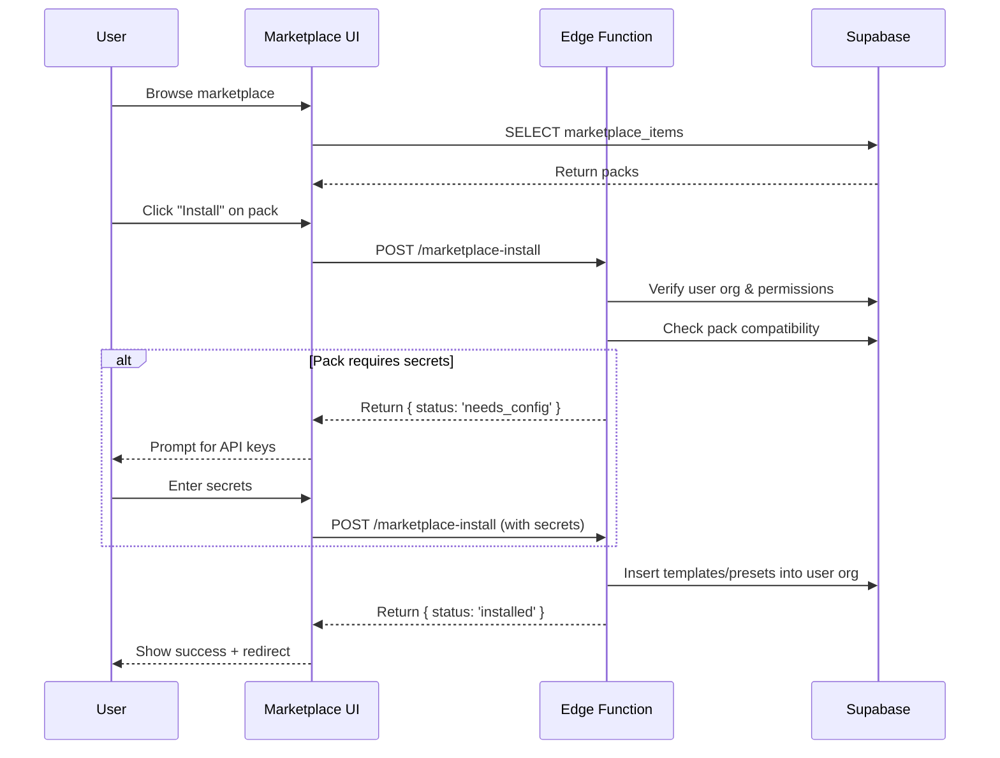

# FlashFusion Marketplace

## Overview

The **FlashFusion Marketplace** is a community-driven platform for sharing and monetizing content packs, templates, integrations, and presets. Creators can publish packs for free or paid distribution, and users can install them with a single click into their workspace.

---

## Pack Format

### Pack Structure

A **pack** is a JSON file with metadata and payload:

```typescript
interface MarketplacePack {
  // Metadata
  name: string;
  description: string;
  type: 'template' | 'preset' | 'integration' | 'workflow';
  version: string;
  author: {
    orgId: string;
    displayName: string;
    avatar?: string;
  };
  pricing: {
    priceCents: number;  // 0 = free
    currency: 'USD';
  };
  thumbnailUrl?: string;
  tags: string[];
  compatibility: {
    minVersion: string;  // Minimum FlashFusion version
  };
  
  // Payload
  content: {
    // Type-specific content
  };
}
```

### Pack Types

#### 1. **Templates**
Reusable content structures (e.g., Instagram carousel, YouTube Short).

```json
{
  "name": "Ecom Product Card",
  "type": "template",
  "content": {
    "type": "image",
    "dimensions": { "width": 1080, "height": 1350 },
    "layers": [
      {
        "type": "image",
        "name": "background",
        "placeholder": "{{product_image}}"
      },
      {
        "type": "text",
        "name": "product_name",
        "placeholder": "{{product_title}}",
        "style": {
          "font": "Inter",
          "size": 48,
          "color": "#000000"
        }
      }
    ]
  }
}
```

#### 2. **Presets**
Pre-configured settings (e.g., brand kit, scheduling preferences).

```json
{
  "name": "Tech Startup Brand Kit",
  "type": "preset",
  "content": {
    "colors": ["#FF7B00", "#00B4D8", "#E91E63"],
    "fonts": ["Sora", "Inter"],
    "logoUrl": "https://...",
    "guidelines": "Use bold colors for CTAs, sans-serif for body text..."
  }
}
```

#### 3. **Integrations**
Third-party API connectors (e.g., Shopify, Stripe, Zapier).

```json
{
  "name": "Shopify Product Importer",
  "type": "integration",
  "content": {
    "provider": "shopify",
    "requiredSecrets": ["SHOPIFY_API_KEY", "SHOPIFY_STORE_URL"],
    "endpoints": [
      {
        "name": "import_products",
        "method": "POST",
        "path": "/integrations/shopify/products"
      }
    ]
  }
}
```

#### 4. **Workflows**
Multi-step automation recipes (e.g., "Generate → Translate → Schedule").

```json
{
  "name": "Influencer Content Pipeline",
  "type": "workflow",
  "content": {
    "steps": [
      {
        "id": "generate",
        "action": "generate_content",
        "params": { "type": "video", "duration": 30 }
      },
      {
        "id": "lint",
        "action": "lint_brand",
        "dependsOn": ["generate"]
      },
      {
        "id": "schedule",
        "action": "schedule_post",
        "dependsOn": ["lint"],
        "params": { "platforms": ["instagram", "tiktok"] }
      }
    ]
  }
}
```

---

## Installation Flow

### User Journey

1. **Browse Marketplace**: User searches/filters packs by type, category, price
2. **Preview Pack**: View metadata, screenshots, compatibility
3. **Install Pack**: Click "Install" → API call to backend
4. **Configure**: If pack requires secrets (e.g., API keys), prompt user
5. **Apply**: Pack content merged into user's workspace

### Mermaid Diagram



---

## Database Schema

### `marketplace_items` Table

```sql
CREATE TABLE public.marketplace_items (
  id UUID PRIMARY KEY DEFAULT gen_random_uuid(),
  name TEXT NOT NULL,
  description TEXT,
  type TEXT NOT NULL CHECK (type IN ('template', 'preset', 'integration', 'workflow')),
  creator_id UUID REFERENCES auth.users(id),
  price_cents INTEGER DEFAULT 0,
  downloads INTEGER DEFAULT 0,
  thumbnail_url TEXT,
  content JSONB NOT NULL,
  created_at TIMESTAMPTZ DEFAULT NOW()
);

-- RLS Policies
ALTER TABLE public.marketplace_items ENABLE ROW LEVEL SECURITY;

-- Anyone can view published packs
CREATE POLICY "Anyone can view marketplace items"
ON public.marketplace_items FOR SELECT
USING (true);

-- Creators can manage their own packs
CREATE POLICY "Creators can manage their items"
ON public.marketplace_items FOR ALL
USING (creator_id = auth.uid());
```

---

## API Endpoints

### `POST /marketplace-install`

**Edge Function**: `supabase/functions/marketplace-install/index.ts`

#### Request

```typescript
{
  packId: string;       // UUID of marketplace item
  orgId: string;        // Target org for installation
  secrets?: Record<string, string>;  // Optional: API keys for integrations
}
```

#### Response

```typescript
{
  status: 'installed' | 'needs_config' | 'error';
  message?: string;
  installedResources?: {
    templates?: string[];  // IDs of created templates
    presets?: string[];    // IDs of created presets
    // ...
  };
}
```

#### Implementation

```typescript
// supabase/functions/marketplace-install/index.ts
import { serve } from 'https://deno.land/std@0.168.0/http/server.ts';
import { createClient } from 'https://esm.sh/@supabase/supabase-js@2';

const corsHeaders = {
  'Access-Control-Allow-Origin': '*',
  'Access-Control-Allow-Headers': 'authorization, x-client-info, apikey, content-type',
};

serve(async (req) => {
  if (req.method === 'OPTIONS') return new Response(null, { headers: corsHeaders });

  try {
    const { packId, orgId, secrets } = await req.json();
    const authHeader = req.headers.get('Authorization')!;
    const supabase = createClient(
      Deno.env.get('SUPABASE_URL')!,
      Deno.env.get('SUPABASE_SERVICE_ROLE_KEY')!,
      { global: { headers: { Authorization: authHeader } } }
    );

    // 1. Fetch pack from marketplace
    const { data: pack, error: packError } = await supabase
      .from('marketplace_items')
      .select('*')
      .eq('id', packId)
      .single();

    if (packError) throw new Error('Pack not found');

    // 2. Verify user is member of target org
    const { data: member } = await supabase
      .from('members')
      .select('role')
      .eq('org_id', orgId)
      .eq('user_id', (await supabase.auth.getUser()).data.user!.id)
      .single();

    if (!member || !['owner', 'admin'].includes(member.role)) {
      return new Response(
        JSON.stringify({ status: 'error', message: 'Insufficient permissions' }),
        { status: 403, headers: { ...corsHeaders, 'Content-Type': 'application/json' } }
      );
    }

    // 3. Check if pack requires secrets
    if (pack.type === 'integration' && pack.content.requiredSecrets) {
      const missingSecrets = pack.content.requiredSecrets.filter(
        (key: string) => !secrets?.[key]
      );
      if (missingSecrets.length > 0) {
        return new Response(
          JSON.stringify({
            status: 'needs_config',
            requiredSecrets: pack.content.requiredSecrets,
          }),
          { headers: { ...corsHeaders, 'Content-Type': 'application/json' } }
        );
      }
    }

    // 4. Install pack based on type
    const installedResources: any = {};

    switch (pack.type) {
      case 'template': {
        const { data: template } = await supabase
          .from('templates')
          .insert({
            org_id: orgId,
            name: pack.name,
            type: pack.content.type,
            content: pack.content,
            thumbnail_url: pack.thumbnail_url,
          })
          .select()
          .single();
        installedResources.templates = [template.id];
        break;
      }

      case 'preset': {
        const { data: brandKit } = await supabase
          .from('brand_kits')
          .insert({
            org_id: orgId,
            name: pack.name,
            colors: pack.content.colors,
            fonts: pack.content.fonts,
            logo_url: pack.content.logoUrl,
            guidelines: pack.content.guidelines,
          })
          .select()
          .single();
        installedResources.presets = [brandKit.id];
        break;
      }

      case 'integration':
        // Store secrets in Supabase Vault (not implemented here)
        // Create integration record
        installedResources.integrations = ['integration-placeholder'];
        break;

      case 'workflow':
        // Create workflow record (not implemented here)
        installedResources.workflows = ['workflow-placeholder'];
        break;
    }

    // 5. Increment download count
    await supabase.rpc('increment_downloads', { pack_id: packId });

    return new Response(
      JSON.stringify({ status: 'installed', installedResources }),
      { headers: { ...corsHeaders, 'Content-Type': 'application/json' } }
    );
  } catch (error) {
    console.error('Install error:', error);
    return new Response(
      JSON.stringify({ status: 'error', message: error.message }),
      { status: 500, headers: { ...corsHeaders, 'Content-Type': 'application/json' } }
    );
  }
});
```

---

## UI Components

### Marketplace Page

```tsx
// src/pages/Marketplace.tsx (enhanced)
import { useState } from 'react';
import { useQuery, useMutation } from '@tanstack/react-query';
import { supabase } from '@/integrations/supabase/client';
import { Button } from '@/components/ui/button';
import { Input } from '@/components/ui/input';
import { Badge } from '@/components/ui/badge';
import { toast } from 'sonner';

export default function Marketplace() {
  const [filter, setFilter] = useState({ type: 'all', search: '' });

  const { data: items } = useQuery({
    queryKey: ['marketplace', filter],
    queryFn: async () => {
      let query = supabase.from('marketplace_items').select('*');
      if (filter.type !== 'all') query = query.eq('type', filter.type);
      if (filter.search) query = query.ilike('name', `%${filter.search}%`);
      const { data } = await query.order('downloads', { ascending: false });
      return data || [];
    },
  });

  const installMutation = useMutation({
    mutationFn: async ({ packId, orgId }: { packId: string; orgId: string }) => {
      const { data } = await supabase.functions.invoke('marketplace-install', {
        body: { packId, orgId },
      });
      return data;
    },
    onSuccess: () => {
      toast.success('Pack installed successfully!');
    },
    onError: () => {
      toast.error('Failed to install pack');
    },
  });

  return (
    <div className="space-y-6">
      <div className="flex gap-4">
        <Input
          placeholder="Search packs..."
          value={filter.search}
          onChange={(e) => setFilter({ ...filter, search: e.target.value })}
        />
        <select
          value={filter.type}
          onChange={(e) => setFilter({ ...filter, type: e.target.value })}
        >
          <option value="all">All Types</option>
          <option value="template">Templates</option>
          <option value="preset">Presets</option>
          <option value="integration">Integrations</option>
          <option value="workflow">Workflows</option>
        </select>
      </div>

      <div className="grid grid-cols-3 gap-6">
        {items?.map((item) => (
          <div key={item.id} className="border rounded-lg p-4">
            
            <h3 className="font-semibold mt-2">{item.name}</h3>
            <p className="text-sm text-muted-foreground">{item.description}</p>
            <div className="flex items-center justify-between mt-4">
              <Badge>{item.type}</Badge>
              <Button
                size="sm"
                onClick={() => installMutation.mutate({ packId: item.id, orgId: 'user-org-id' })}
              >
                {item.price_cents === 0 ? 'Free' : `$${(item.price_cents / 100).toFixed(2)}`}
              </Button>
            </div>
          </div>
        ))}
      </div>
    </div>
  );
}
```

---

## Example Packs

See `example_packs/` directory for JSON samples:
1. **universal-app-scaffold.json**: Next.js + Supabase starter
2. **ecom-storefront.json**: Shopify integration pack
3. **creator-toolkit.json**: Influencer content generator

---

## Scaling Considerations

### Phase 1 (MVP)
- All packs stored in `marketplace_items` table (JSONB)
- No payment processing (free packs only)
- Manual approval for new pack submissions

### Phase 2 (Q2 2025)
- **Stripe integration** for paid packs
- **Automated moderation** (AI-powered review)
- **Pack versioning** (users can roll back)

### Phase 3 (Q3 2025)
- **Pack dependencies** (e.g., integration requires preset)
- **Pack bundles** (discounted multi-pack purchases)
- **Creator analytics** (download stats, revenue)

---

## Related Documentation

- [Architecture Overview](./architecture.md)
- [Security & RLS](./security.md)
- [API Documentation](./openapi.yaml)
