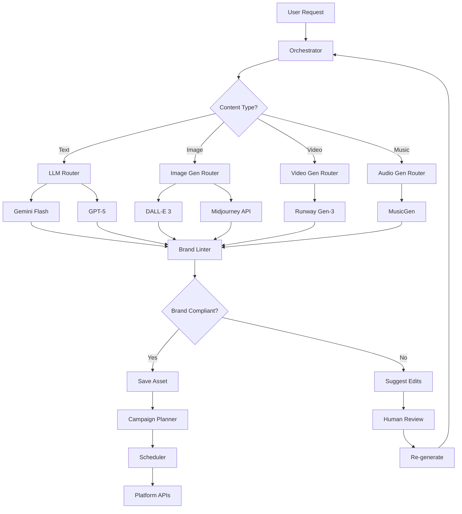

# FlashFusion Orchestrator

## Overview

The **FlashFusion Orchestrator** is the AI-powered coordination layer that manages multi-step workflows for content generation, campaign planning, and intelligent scheduling. It acts as the "brain" of the system, deciding which AI models to invoke, how to sequence tasks, and how to enforce brand consistency.

---

## Architecture

### Core Responsibilities

1. **Workflow Orchestration**: Coordinates multi-step processes (e.g., generate → lint → translate → schedule)
2. **Model Selection**: Routes requests to appropriate AI models based on content type and quality requirements
3. **Brand Enforcement**: Validates assets against brand kit rules before approval
4. **Error Handling**: Implements retry logic, fallbacks, and graceful degradation
5. **Provenance Tracking**: Records metadata for all AI-generated content

### System Diagram



---

## Workflow Orchestration

### Example: Generate → Lint → Deploy

```typescript
// Orchestrator pseudo-code
async function orchestrateAssetCreation(request: AssetRequest) {
  // 1. Generate content with selected AI model
  const asset = await generateContent({
    type: request.contentType,
    prompt: request.prompt,
    model: selectModel(request.contentType, request.quality),
  });
  
  // 2. Validate against brand kit
  const brandKit = await getBrandKit(request.orgId);
  const lintResults = await lintAsset(asset, brandKit);
  
  if (!lintResults.isCompliant) {
    // 3. Suggest fixes or reject
    return {
      status: 'needs_review',
      asset,
      violations: lintResults.violations,
      suggestions: lintResults.fixes,
    };
  }
  
  // 4. Save with provenance
  const savedAsset = await saveAsset({
    ...asset,
    orgId: request.orgId,
    userId: request.userId,
    provenance: {
      model: asset.model,
      promptHash: hash(request.prompt),
      brandKitId: brandKit.id,
      lintPassed: true,
      generatedAt: new Date().toISOString(),
    },
  });
  
  // 5. Optionally add to campaign
  if (request.campaignId) {
    await addToCampaign(request.campaignId, savedAsset.id);
  }
  
  return { status: 'success', asset: savedAsset };
}
```

---

## Model Selection

### Router Logic

The orchestrator selects AI models based on:
- **Content type** (text, image, video, music)
- **Quality tier** (draft, standard, premium)
- **Cost constraints** (budget limits per org)
- **Latency requirements** (real-time vs. batch)

### Model Matrix

| Content Type | Draft | Standard | Premium |
|--------------|-------|----------|---------|
| **Text** | Gemini Flash Lite | Gemini Flash | GPT-5 / Gemini Pro |
| **Image** | DALL-E 2 | DALL-E 3 | Midjourney v6 |
| **Video** | Runway Gen-2 | Runway Gen-3 | Sora (waitlist) |
| **Music** | MusicGen | MusicGen XL | Suno v3 |

### Implementation

```typescript
function selectModel(contentType: ContentType, quality: QualityTier): string {
  const modelMap = {
    text: {
      draft: 'google/gemini-2.5-flash-lite',
      standard: 'google/gemini-2.5-flash',
      premium: 'openai/gpt-5',
    },
    image: {
      draft: 'dall-e-2',
      standard: 'dall-e-3',
      premium: 'midjourney-v6',
    },
    // ... other content types
  };
  
  return modelMap[contentType][quality];
}
```

---

## Brand Enforcement

### Linter Rules

The **Brand Linter** validates assets against org-specific brand kits:

1. **Colors**: Extract dominant colors from images; flag if not in brand palette
2. **Fonts**: OCR text in images; ensure fonts match brand kit
3. **Logo Placement**: Detect logo in images; validate position/size guidelines
4. **Tone/Voice**: Analyze text sentiment; compare to brand voice guidelines
5. **Legal Compliance**: Check for banned words, copyright issues, NSFW content

### Example: Image Color Validation

```typescript
async function validateImageColors(imageUrl: string, brandKit: BrandKit) {
  // 1. Extract dominant colors from image
  const dominantColors = await extractColors(imageUrl, { count: 5 });
  
  // 2. Convert to HSL for comparison
  const imageHSL = dominantColors.map(rgbToHSL);
  const brandHSL = brandKit.colors.map(rgbToHSL);
  
  // 3. Check if at least 70% of dominant colors are "close" to brand colors
  const matchCount = imageHSL.filter(imgColor =>
    brandHSL.some(brandColor => colorDistance(imgColor, brandColor) < 30)
  ).length;
  
  const compliance = matchCount / imageHSL.length;
  
  return {
    isCompliant: compliance >= 0.7,
    compliance,
    violations: compliance < 0.7
      ? [`Only ${(compliance * 100).toFixed(0)}% of colors match brand palette`]
      : [],
    suggestions: compliance < 0.7
      ? [`Consider using these brand colors: ${brandKit.colors.slice(0, 3).join(', ')}`]
      : [],
  };
}
```

---

## Error Handling

### Retry Logic

All orchestrator tasks implement **exponential backoff** with jitter:

```typescript
async function withRetry<T>(
  fn: () => Promise<T>,
  options: RetryOptions = {}
): Promise<T> {
  const {
    maxRetries = 3,
    initialDelay = 1000,
    maxDelay = 30000,
    backoffFactor = 2,
  } = options;
  
  let lastError: Error;
  
  for (let attempt = 0; attempt <= maxRetries; attempt++) {
    try {
      return await fn();
    } catch (error) {
      lastError = error as Error;
      
      if (attempt === maxRetries) break;
      
      // Exponential backoff with jitter
      const delay = Math.min(
        initialDelay * Math.pow(backoffFactor, attempt) * (1 + Math.random() * 0.1),
        maxDelay
      );
      
      console.warn(`Retry attempt ${attempt + 1}/${maxRetries} after ${delay}ms`, error);
      await sleep(delay);
    }
  }
  
  throw lastError!;
}
```

### Fallback Strategies

When primary model fails:
1. **Retry** same model (transient errors)
2. **Fallback** to lower-tier model (e.g., GPT-5 → Gemini Flash)
3. **Queue for batch** (non-urgent requests)
4. **Notify user** (unrecoverable errors)

---

## Provenance Tracking

Every AI-generated asset includes provenance metadata:

```typescript
interface Provenance {
  model: string;               // e.g., "google/gemini-2.5-flash"
  promptHash: string;          // SHA-256 of user prompt
  datasetTag?: string;         // Training data version (if known)
  generatedAt: string;         // ISO timestamp
  brandKitId?: string;         // Associated brand kit
  lintPassed: boolean;         // Brand compliance
  humanEdited: boolean;        // User made manual edits
  parentAssetId?: string;      // If derived from another asset
}
```

This enables:
- **Audit trails** for legal/compliance
- **A/B testing** different models
- **Cost attribution** per model/org
- **Quality analysis** (which models produce best results)

---

## Observability

### Tracing

All orchestrator operations emit OpenTelemetry spans:

```typescript
import { Analytics } from '@/lib/observability';

async function orchestrateAssetCreation(request: AssetRequest) {
  return Analytics.traceOperation('asset_creation', async () => {
    const asset = await Analytics.traceOperation('generate_content', () =>
      generateContent(request)
    );
    
    const lintResults = await Analytics.traceOperation('lint_asset', () =>
      lintAsset(asset, brandKit)
    );
    
    // ... rest of workflow
  });
}
```

### Metrics

Key metrics tracked via PostHog:
- **Generation latency** (P50, P95, P99 per model)
- **Brand compliance rate** (% assets passing lint on first try)
- **Retry rate** (% requests requiring retries)
- **Cost per asset** (API charges per model)
- **Human intervention rate** (% assets requiring manual review)

---

## Future Enhancements

### Phase 2 (Q2 2025)
- **Multi-modal generation**: Text + image in single request
- **Style transfer**: Apply brand style to user-uploaded images
- **Predictive caching**: Pre-generate popular content types

### Phase 3 (Q3 2025)
- **Reinforcement learning**: Learn from user edits to improve prompts
- **Federated learning**: Train custom models on org data (privacy-preserving)
- **Agentic workflows**: Orchestrator proposes entire campaigns autonomously

---

## Related Documentation

- [Architecture Overview](./architecture.md)
- [Performance Optimization](./performance.md)
- [Security & RLS](./security.md)
- [API Documentation](./openapi.yaml)
